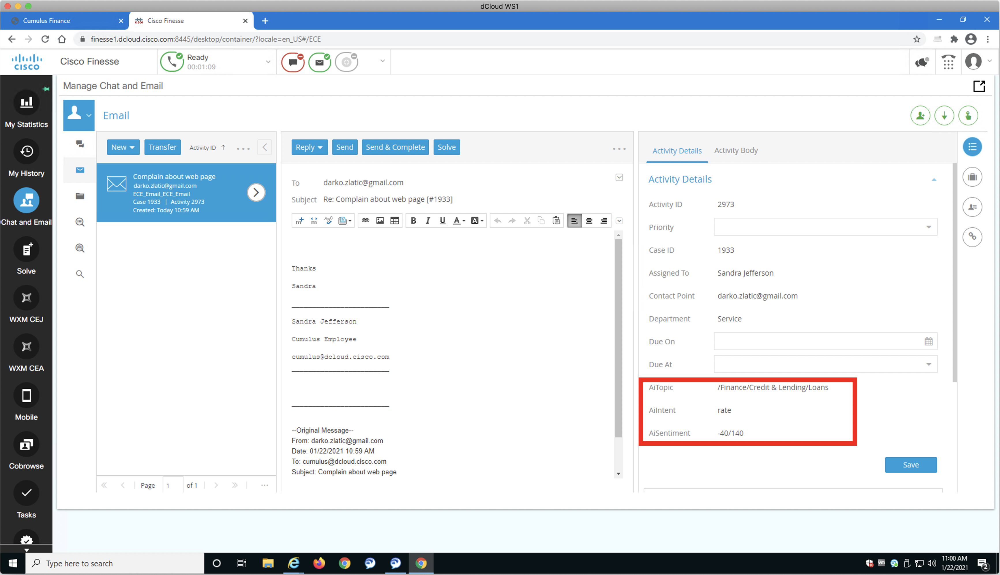
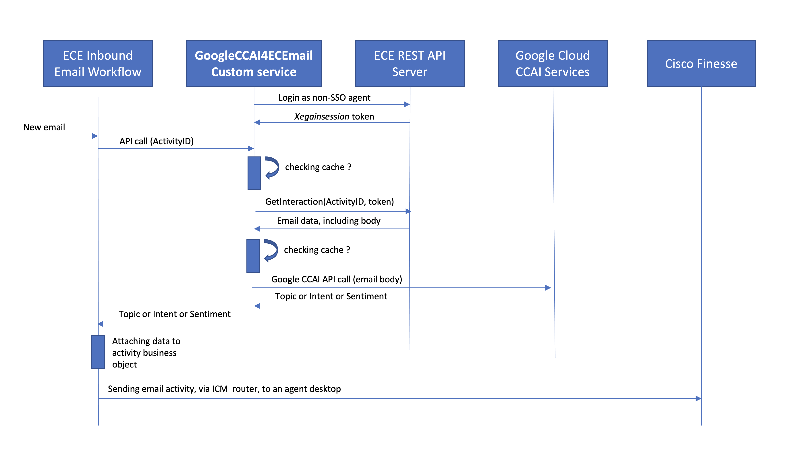
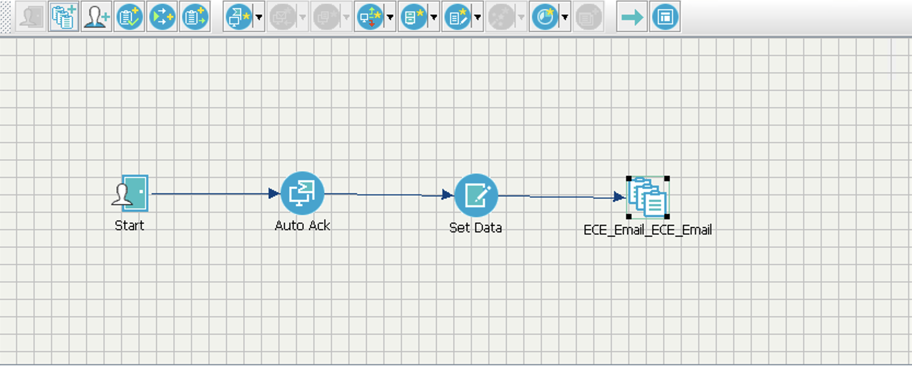
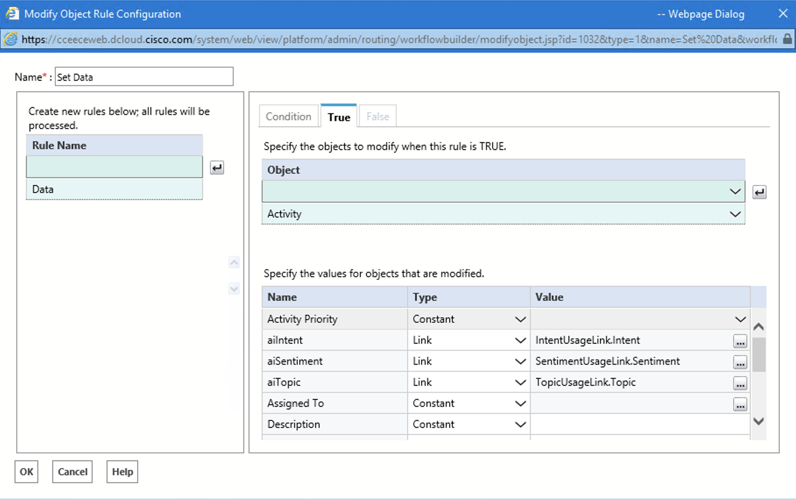

### simple custom service  project
  # GoogleCCAI4ECEmail 

Here we are showing a simple custom service based on Node Express, named GoogleCCAI4ECEmail, that is meant to extend Cisco Enterprise Chat & Email (ECE) email processing capabilities using AI. 

This work was done with an intention to provide new Cisco PCCE demo capability, as well as to encourage Cisco Partners to come up with similar solutions. It is developed in PCCE 12.5 v2 dCloud instance, that is saved and sharable.

GoogleCCAI4ECEmail service provides REST interface for getting the email classification(topic), sentiment analysis  and also an intent recognized in the content of the email by Google Cloud Contact Center Artificial Intelligence  (CCAI) services and APIs.

In essence, when data are obtained from Google CCAI using this service, those are stored in email activity business object using ECE Email Workflow, and then provided as part of activity details, as shown in an example on the picture below:

In this particular example, the email that has been routed to the agent using Finesse ECE Gadget had the following content:

_"I am extremely frustrated with your web site information. I would like to learn mortgage rates, but I cannot find them anywhere. I have spent half an hour wondering around the site, but no information was helpful and complete."_

From this, we can see that this is about finance & lending, so [Google CCAI Text Classification](https://cloud.google.com/natural-language/docs/classify-text-tutorial), that is part of [Google NLP API](https://cloud.google.com/natural-language) returned result shown in __AiTopic__ filed. 

The intent, per model loaded in PCCE 12.5 V2 dCloud demo, was recognized as __"rate"__ and captured in __AiIntent__ field, using [DialogFlow API](https://cloud.google.com/dialogflow/es/docs/reference/rest/v2-overview). 

Finally, as the email is quite negative in its narrative, [Google Sentiment Analisys](https://cloud.google.com/natural-language/docs/sentiment-tutorial), that is also part of [Google NLP API](https://cloud.google.com/natural-language),  returned __AiSentiment__ as __"-40/120"__ where __"-40"__ is sentiment __score__ and __"120"__ is sentiment __magnitude__. Keep in mind that Google results are comming in [-1, 1]
floating point interval, but here are scaled to [-100, 100] integer interval, due to ECE custom data requirements.

When started, the service first connects using [__ECE REST API__](https://developer.cisco.com/docs/enterprise-chat-and-email/#!interaction-api-developer-guide) and establishes the secure session, so that it can use the ECE Interaction API to obtain the text of email content, cache it, and then  use it for Google CCAI API calls. Also, API calls to Google CCAI are cached as well.
  

  

When ECE Inbound Email Workflow process new email, it can use one of several REST services provided by GoogleCCAI4ECEmail custom service, depending on dersired Google CCAI API, per table:

| Google CCAI API |Method | Resource          |
| :------------- |:-------------:| :-------------|
| *NLP Classification* |  __GET__ | __/topic/:activityID__ | 
| *DialogFlow API* |  __GET__ | __/intent/:activityID__ |  
| *NLP Sentiment Analisys* |  __GET__ | __/sentiment/:activityID__ | 

In our example, we used all three of them, to collect, store and present AI data to the agent. With additional ECE configuration, this new data could be also used to improve email routing, selection of templates and other KB articles, to feed customer journey analytics and many other customer requirements.

  
# ECE Configuration 

__*This configuration assumes you are connected to dCloud PCCE 12.5 V2 demo instance! In case you are using pre-configured GoogleCCAI4ECEmail dCloud instance, you can go straight to Service Installation steps*__

1. In order to use ECE Interaction APIs in your application/service, the user authentication must be used. Check [__ECE Interaction API Developers Guide__](https://developer.cisco.com/docs/enterprise-chat-and-email/#!interaction-api-developer-guide). For that purpose, you should make sure that parameter __Administration/Partition/Security/SSO and Provisioning/SSO Configuration/Agent Configuration/Allow local login for specific users__ has value __Yes__.
 

2. Create new or use an available existing agent within [__Unified Contact Center Enterprise Management/User Setup/Agents__](https://ccedata.dcloud.cisco.com/cceadmin/#/overview), making sure it is not SSO enabled, and that it can login directly into ECE agent interface with user name and password set in the setup. This agent would be your API user, and you would also set up __ECE_USER_NAME__ and __ECE_USER_PASSWORD__ values in [__.env file__](./env) accordingly.
 

3. Add the following custom fields into Activity Business object in [__ECE Administration__](https://cceeceweb.dcloud.cisco.com/system/web/view/platform/common/login/root.jsp?partitionId=0) (IE required!), going to __Tools/Partition: default/Business Objects/Attribute Settings/System/Activity Data/Custom__:

| Name | DataType | Definition/DataSize | View |
|:-----|:--------:|:-------------:|:------------:| 
| __`aiTopic`__     |  __`String`__ | __`30`__ | __`checked`__ |
| __`aiIntent`__    |  __`String`__ | __`50`__ | __`checked`__ | 
| __`aiSentiment`__    |  __`String`__ | __`10`__ | __`checked`__ |

Leave all unspecified parameters on default values. We are not going to use those fields in search, so don't worry about reindexing the database upon warning.
 

4. Make sure new fields can be shown withing Activity Details in Finesse Gadget, by enabling them in  __ECE Administration/Tools/Departments/Service/Business Objects/Attribute Settings/Screen/Agent Console - Information Email Activity Details Screen/Attributes__.
 

5. Configure Data Access Links in [__Unified Contact Center Enterprise Management/Email and Chat/Data Adapters/Access Links__](https://ccedata.dcloud.cisco.com/cceadmin/#/overview) per table below, leaving all unspecified parameters on default values. You also need to obtain the IP address of your own machine after connecting to VPN, so that you can use it as service_host in Input/URLs.

| General/Name | General/Method | Input/URL | Input/Authentication | Input/Accept | Input/ContentType | Output/ExtractOrFilter | Output/Path | Output/InternalFiledName |
|:------|:------:|:------|:-----:|:-------|:---------|:-------:|:-------|:-------| 
| __`TopicAccessLink`__     |  __`GET`__ | __`http://service_host:3000/topic/<%activityid%>`__ | __`None`__ | __`application/json`__ | __`application/x-www-form-encoded`__ | __`Extract`__ | __`$.topic`__ | __`Topic`__ |
| __`IntentAccessLink`__     |  __`GET`__ | __`http://service_host:3000/intent/<%activityid%>`__ |  __`None`__ | __`application/json`__ | __`application/x-www-form-encoded`__ | __`Extract`__ | __`$.intent`__ | __`Intent`__ |
| __`SentimentAccessLink`__     |  __`GET`__ | __`http://service_host:3000/sentiment/<%activityid%>`__ | __`None`__ | __`application/json`__ | __`application/x-www-form-encoded`__ | __`Extract`__ | __`$.sentiment`__ | __`Sentiment`__ |
 

6. Configure Data Usage Links [__Unified Contact Center Enterprise Management/Email and Chat/Data Adapters/Usage Links__](https://ccedata.dcloud.cisco.com/cceadmin/#/overview) per following table, leaving all unspecified parameters on default values: 

| General/Name | DataAccessLinks | Input/DataAccessLink | Input/ParameterName | Input/ParameterValue | Output/DataAccessLink | Output/FiledName | Output/DisplayName | Output/FieledWidth |
|:------|:------|:-----|:-----:|:----:|:----|:----|:-----|:-----:| 
| __`TopicUsageLink`__     |  __`TopicAccessLink`__ | __`TopicAccessLink`__ | __`activityid`__ | __\`\`acctivity_id__ | __`TopicAccessLink`__ | __`Topic`__ | __`Topic`__ | __`50`__ |
| __`IntentUsageLink`__     |  __`IntentAccessLink`__ | __`IntentAccessLink`__ | __`activityid`__ | __\`\`acctivity_id__ | __`IntentAccessLink`__ | __`Intent`__ | __`Intent`__ | __`30`__ |
| __`SentimentUsageLink`__     |  __`SentimentAccessLink`__ | __`SentimentAccessLink`__ | __`activityid`__ | __\`\`acctivity_id__ | __`SentimentAccessLink`__ | __`Sentiment`__ | __`Sentiment`__ | __`10`__ |
 

7. Configure and activate simple workflow in __ECE Administration/Departments/Service/Workflow/Workflows/Inbound__ like on the diagram:
 

 

8. Make sure Modify Object Node "Set Data" is set with new fields, like shown on the picture:
 

  
## Service Installation 

1. While connected to dCloud instance via VPN, you can run this custom service on your own machine, making sure you have installed __node__ version  __v14.2.0 or higher__, as well as __npm__ version __6.14.4 or higher__. If you already have some previous versions running, you may try those as they would most likely work, but above-mentioned versions are confirmed to be friendly to the code. 

2. In your working directory use __git clone__ or __zip__ from this repository to deploy the code. 

3. If you are using dCloud, you can skip this step and use .pem file from the repository. If you are deploying outside of dCloud, you will need to download the certificate from your ECE server as .pem and store in the __/resources__ path of the project and configure ECE_SEREVER_CERTIFICATE_PATH in [__.env file__](./.env). Here it is a useful [stackexchange.com](https://unix.stackexchange.com/questions/368123/how-to-extract-the-root-ca-and-subordinate-ca-from-a-certificate-chain-in-linux) and [medium.com](https://medium.com/@superseb/get-your-certificate-chain-right-4b117a9c0fce) links should you need some help.

4. You will also need your own __Google Cloud Platform account__, and you need to make sure __DialogFlow API__ and __Cloud Natural Language API__ are enabled. Look into Vertical Customization Toolbox Guide and follow instructions to install DalogFlow model. Create __Service Account Credentials__, download the credentials file and configure __GOOGLE_APPLICATION_CREDENTIALS__ and __GOOGLE_CLOUD_PROJECT_ID__ in [__.env file__](./.env). __GOOGLE_CLOUD_SESSION_ID__ could be random integer. 

5. If you want the service to use timestamps while writing console messages, set __REQUIRE_TIMESTAMPS__ to __Yes__.

6. In root of the deployment directory run __npm install__. Once all dependencies are installed, run __npm start__.

##  Please be aware that this is not ready to use solution, Quality of Google CCAI APIs should be tested in perticlular context, also adding some additional code to handle various Google CCAI exceptions should be anticipated. Make sure you test first the responces you are getting before using this in any demo!!! 

